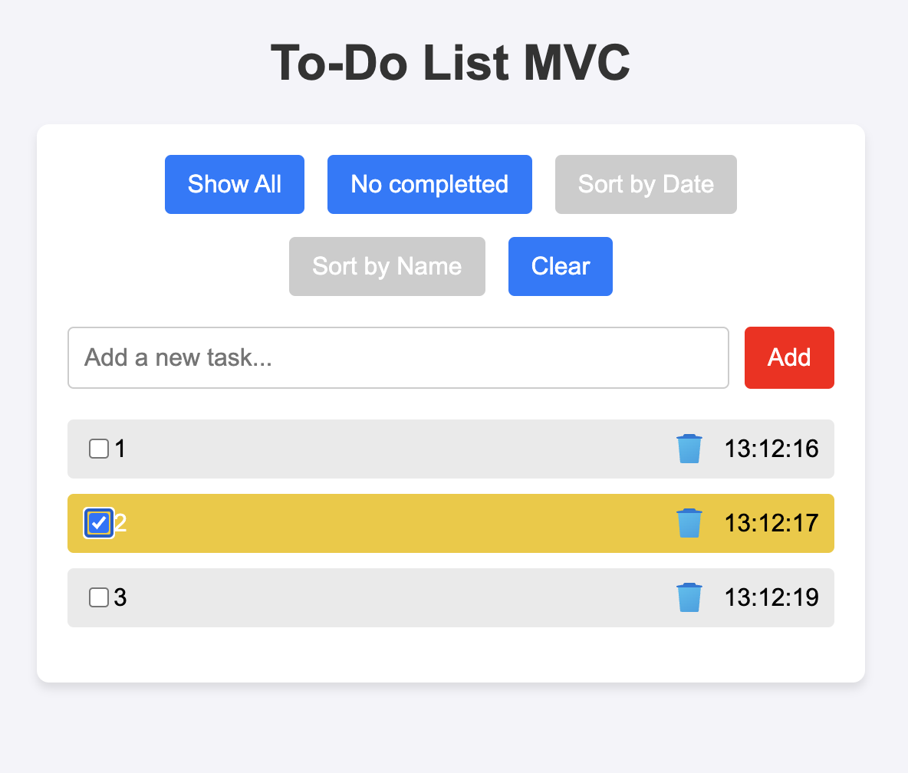

# Todo List MVC

<b>DESCRIPTION</b>:
 

Its easy todo list made on MVC template

OPTIONS:

<b>Show All</b> - show all items form view

<b>No completted</b> - show only no completted items from view

<b>Clear</b> - clear model massive && clear view

Click on input to complete the task

